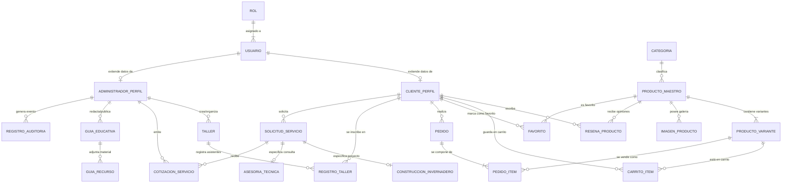
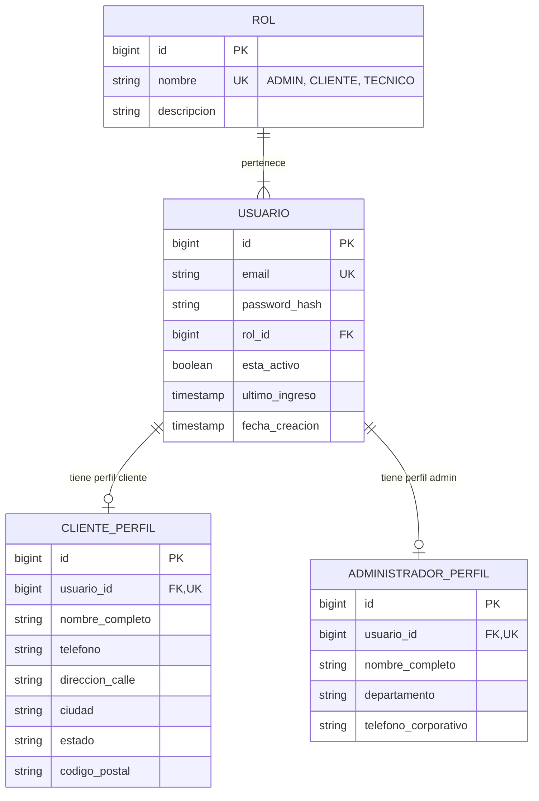
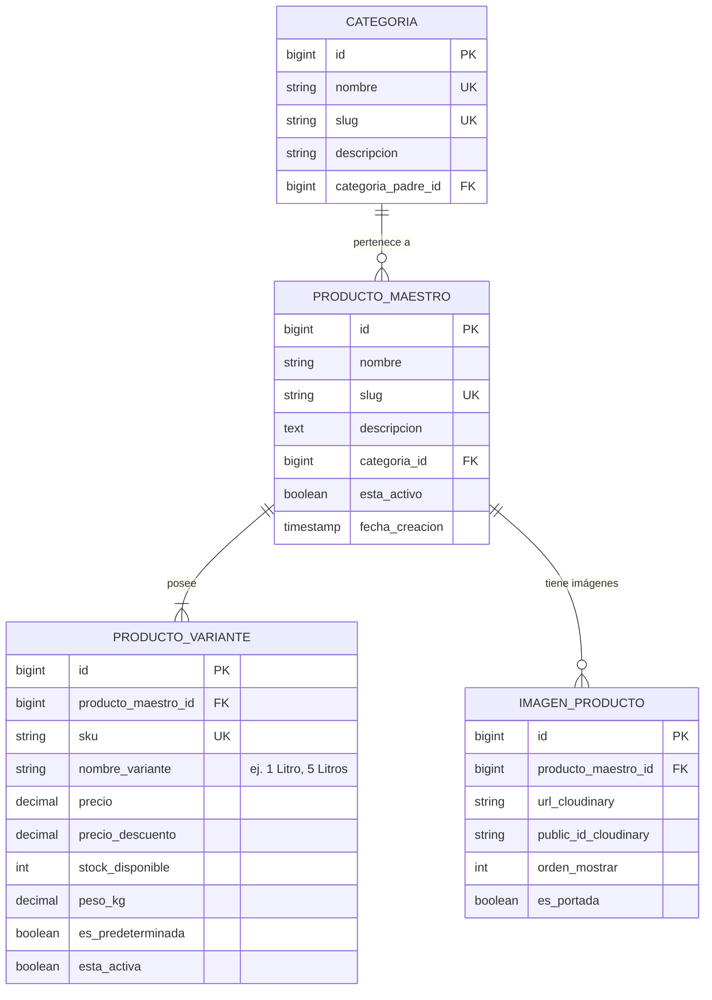
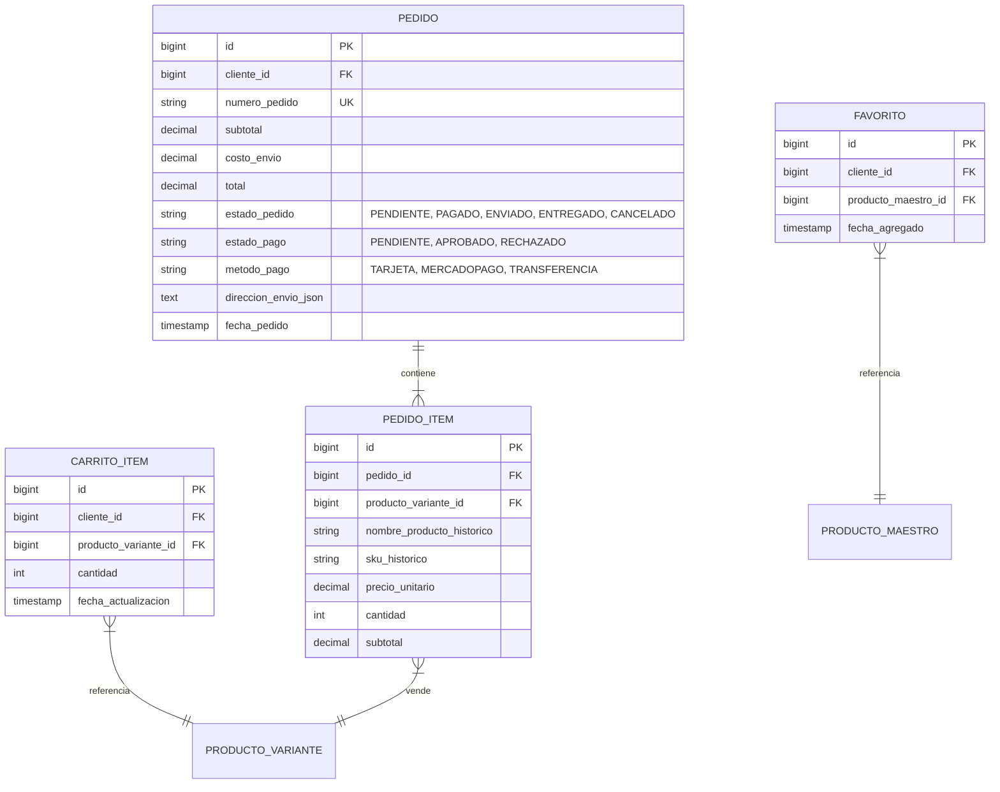
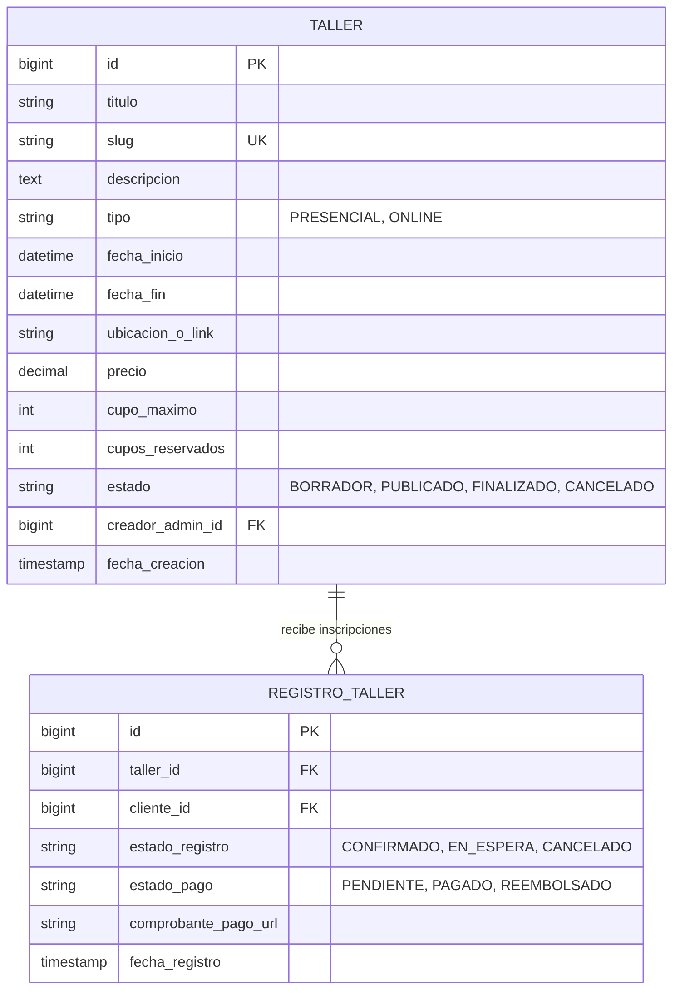
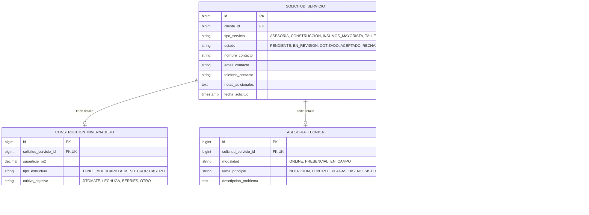
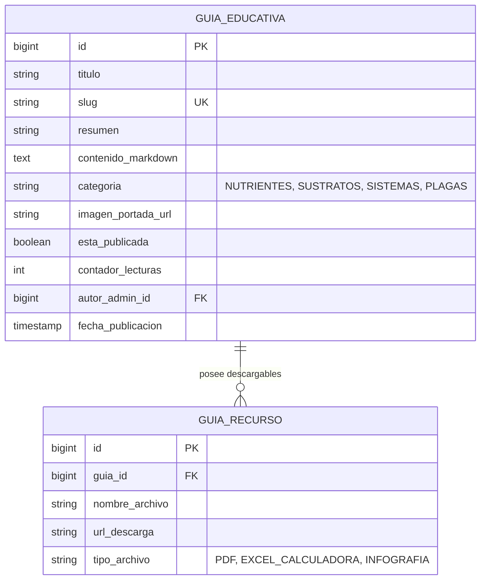
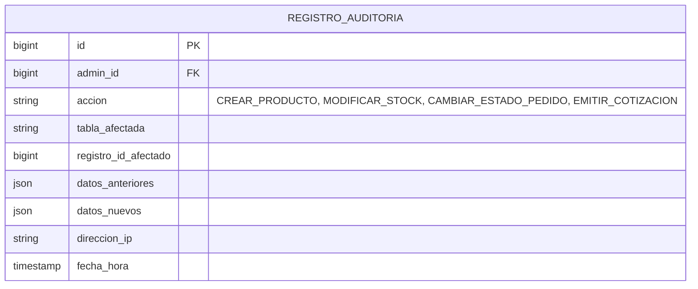

# Modelo Entidad-Relación (E-R) de Base de Datos — Honatu Hidroponía

Este documento especifica el **Modelo Entidad-Relación (E-R)** completo para la base de datos relacional de **Honatu Hidroponía**. El diseño responde a la arquitectura unificada de la plataforma, permitiendo que tanto **Clientes** (compras, inscripciones, solicitudes de servicios, consulta de guías) como **Administradores** (gestión del catálogo, inventario, moderación de talleres, seguimiento de cotizaciones y auditoría) interactúen de forma segura a través de un único sistema.

---

## 1. Visión General del Sistema

La base de datos está estructurada en **7 Módulos Principales**:

1. **Usuarios y Autenticación**: Gestión unificada de identidades (`USUARIO`, `CLIENTE_PERFIL`, `ADMINISTRADOR_PERFIL`, `ROL`, `PERMISO`).
2. **Catálogo de Tienda (E-Commerce)**: Separación de producto maestro y variantes (`PRODUCTO_MAESTRO`, `PRODUCTO_VARIANTE`, `CATEGORIA`, `IMAGEN_PRODUCTO`).
3. **Ventas y Transacciones**: Gestión de compras, favoritos y carritos (`PEDIDO`, `PEDIDO_ITEM`, `CARRITO_ITEM`, `FAVORITO`).
4. **Talleres y Capacitación**: Oferta educativa e inscripciones (`TALLER`, `REGISTRO_TALLER`).
5. **Servicios Especializados**: Proyectos técnicos y consultas (`SOLICITUD_SERVICIO`, `CONSTRUCCION_INVERNADERO`, `ASESORIA_TECNICA`).
6. **Educación y Guías**: Portal de contenido (`GUIA_EDUCATIVA`, `GUIA_RECURSO`).
7. **Administración y Auditoría**: Trazabilidad y control (`REGISTRO_AUDITORIA`, `COTIZACION_SERVICIO`).

---

## 2. Diagrama Entidad-Relación Global



---

## 3. Diagramas E-R por Módulo

### Módulo 1: Usuarios, Autenticación y Perfiles
Permite que administradores y clientes compartan el mismo motor de credenciales, diferenciando permisos e información de perfil.



---

### Módulo 2: Catálogo de Tienda (Producto Maestro y Variante)
Soporta productos con múltiples configuraciones (ej. Solución Nutritiva A+B en presentaciones de 1L, 5L, 20L; Fibra de coco en costales de 10L o 50L).



---

### Módulo 3: Ventas, Pedidos, Carrito y Favoritos



---

### Módulo 4: Talleres y Capacitación
Permite a los administradores publicar talleres (presenciales u online) y a los clientes inscribirse y gestionar sus cupos.



---

### Módulo 5: Servicios Especializados (Construcción de Invernaderos y Asesorías)



---

### Módulo 6: Educación y Guías Educativas



---

### Módulo 7: Panel Administrativo y Auditoría



---

## 4. Diccionario de Datos Completo

### 4.1. Tabla: `usuarios`
Almacena las credenciales de acceso para Clientes, Administradores y Técnicos.

| Campo | Tipo de Dato | Restricciones | Descripción |
| :--- | :--- | :--- | :--- |
| `id` | BIGINT | `PRIMARY KEY, AUTO_INCREMENT` | Identificador único del usuario. |
| `email` | VARCHAR(150) | `UNIQUE, NOT NULL` | Correo electrónico de inicio de sesión. |
| `password_hash` | VARCHAR(255) | `NOT NULL` | Hash seguro de contraseña (Bcrypt/Argon2). |
| `rol_id` | BIGINT | `FOREIGN KEY (roles.id)` | Rol asignado en el sistema. |
| `esta_activo` | BOOLEAN | `DEFAULT TRUE` | Estado de la cuenta (activo/suspendido). |
| `ultimo_ingreso` | TIMESTAMP | `NULL` | Fecha de la última sesión iniciada. |
| `fecha_creacion`| TIMESTAMP | `DEFAULT CURRENT_TIMESTAMP` | Fecha de registro. |

---

### 4.2. Tabla: `clientes_perfil`
Información detallada para usuarios con rol `CLIENTE`.

| Campo | Tipo de Dato | Restricciones | Descripción |
| :--- | :--- | :--- | :--- |
| `id` | BIGINT | `PRIMARY KEY, AUTO_INCREMENT` | Identificador único del perfil. |
| `usuario_id` | BIGINT | `UNIQUE, FOREIGN KEY (usuarios.id) ON DELETE CASCADE` | Relación 1:1 con `usuarios`. |
| `nombre_completo`| VARCHAR(150)| `NOT NULL` | Nombre y apellidos del cliente. |
| `telefono` | VARCHAR(20) | `NULL` | Teléfono / WhatsApp de contacto. |
| `direccion_calle`| VARCHAR(255)| `NULL` | Dirección de entrega principal. |
| `ciudad` | VARCHAR(100) | `NULL` | Ciudad. |
| `estado` | VARCHAR(100) | `NULL` | Estado / Provincia. |
| `codigo_postal` | VARCHAR(10) | `NULL` | Código Postal. |

---

### 4.3. Tabla: `administradores_perfil`
Información del personal interno con rol `ADMINISTRADOR`.

| Campo | Tipo de Dato | Restricciones | Descripción |
| :--- | :--- | :--- | :--- |
| `id` | BIGINT | `PRIMARY KEY, AUTO_INCREMENT` | ID de administrador. |
| `usuario_id` | BIGINT | `UNIQUE, FOREIGN KEY (usuarios.id) ON DELETE CASCADE` | Relación 1:1 con `usuarios`. |
| `nombre_completo`| VARCHAR(150)| `NOT NULL` | Nombre del administrador. |
| `departamento` | VARCHAR(100) | `DEFAULT 'Ventas & Soporte'` | Área o departamento interno. |
| `telefono_corporativo`| VARCHAR(20)| `NULL` | Teléfono corporativo. |

---

### 4.4. Tabla: `productos_maestros`
Representa el concepto general del producto en el catálogo.

| Campo | Tipo de Dato | Restricciones | Descripción |
| :--- | :--- | :--- | :--- |
| `id` | BIGINT | `PRIMARY KEY, AUTO_INCREMENT` | ID del producto maestro. |
| `nombre` | VARCHAR(200) | `NOT NULL` | Nombre comercial (ej. Solución Nutritiva A+B). |
| `slug` | VARCHAR(220) | `UNIQUE, NOT NULL` | URL amigable SEO. |
| `descripcion` | TEXT | `NULL` | Descripción detallada del producto. |
| `categoria_id` | BIGINT | `FOREIGN KEY (categorias.id)` | Categoría del catálogo. |
| `esta_activo` | BOOLEAN | `DEFAULT TRUE` | Visibilidad en la tienda. |
| `fecha_creacion`| TIMESTAMP | `DEFAULT CURRENT_TIMESTAMP` | Fecha de creación en catálogo. |

---

### 4.5. Tabla: `productos_variantes`
Representa las presentaciones específicas y niveles de stock de un producto maestro.

| Campo | Tipo de Dato | Restricciones | Descripción |
| :--- | :--- | :--- | :--- |
| `id` | BIGINT | `PRIMARY KEY, AUTO_INCREMENT` | ID de la variante. |
| `producto_maestro_id` | BIGINT | `FOREIGN KEY (productos_maestros.id) ON DELETE CASCADE` | Relación con el producto maestro. |
| `sku` | VARCHAR(50) | `UNIQUE, NOT NULL` | Código de inventario único (ej. NUT-AB-1L). |
| `nombre_variante`| VARCHAR(100)| `NOT NULL` | Nombre de la presentación (ej. 1 Litro, 5 Kg). |
| `precio` | DECIMAL(10,2)| `NOT NULL` | Precio de venta normal (MXN). |
| `precio_descuento`| DECIMAL(10,2)| `NULL` | Precio promocional. |
| `stock_disponible`| INT | `NOT NULL, DEFAULT 0` | Cantidad en existencia para venta. |
| `peso_kg` | DECIMAL(8,2) | `DEFAULT 0.00` | Peso para cálculo de envío. |
| `es_predeterminada`| BOOLEAN | `DEFAULT FALSE` | Indica si es la variante inicial al seleccionar. |
| `esta_activa` | BOOLEAN | `DEFAULT TRUE` | Permite deshabilitar presentaciones sin borrar. |

---

### 4.6. Tabla: `talleres`
Eventos de capacitación presenciales y online gestionados desde el panel admin.

| Campo | Tipo de Dato | Restricciones | Descripción |
| :--- | :--- | :--- | :--- |
| `id` | BIGINT | `PRIMARY KEY, AUTO_INCREMENT` | ID del taller. |
| `titulo` | VARCHAR(200) | `NOT NULL` | Título del evento (ej. Taller NFT Práctico). |
| `slug` | VARCHAR(220) | `UNIQUE, NOT NULL` | URL amigable. |
| `descripcion` | TEXT | `NOT NULL` | Temario y objetivos del taller. |
| `tipo` | ENUM | `'PRESENCIAL', 'ONLINE'` | Modalidad de impartición. |
| `fecha_inicio` | DATETIME | `NOT NULL` | Fecha y hora de inicio. |
| `fecha_fin` | DATETIME | `NOT NULL` | Fecha y hora de conclusión. |
| `ubicacion_o_link`| VARCHAR(255)| `NOT NULL` | Dirección física o enlace Zoom/Meet. |
| `precio` | DECIMAL(10,2)| `NOT NULL, DEFAULT 0.00` | Costo por participante. |
| `cupo_maximo` | INT | `NOT NULL` | Número límite de asistentes. |
| `cupos_reservados`| INT | `DEFAULT 0` | Contador dinámico de inscripciones. |
| `estado` | ENUM | `'BORRADOR', 'PUBLICADO', 'FINALIZADO', 'CANCELADO'` | Estado operativo del taller. |
| `creador_admin_id`| BIGINT | `FOREIGN KEY (administradores_perfil.id)` | Admin creador del evento. |

---

### 4.7. Tabla: `registros_talleres`
Inscripciones de los clientes a los talleres.

| Campo | Tipo de Dato | Restricciones | Descripción |
| :--- | :--- | :--- | :--- |
| `id` | BIGINT | `PRIMARY KEY, AUTO_INCREMENT` | ID del registro. |
| `taller_id` | BIGINT | `FOREIGN KEY (talleres.id) ON DELETE CASCADE` | Taller seleccionado. |
| `cliente_id` | BIGINT | `FOREIGN KEY (clientes_perfil.id)` | Cliente inscrito. |
| `estado_registro` | ENUM | `'CONFIRMADO', 'EN_ESPERA', 'CANCELADO'` | Estatus de la reservación. |
| `estado_pago` | ENUM | `'PENDIENTE', 'PAGADO', 'REEMBOLSADO'` | Estatus del cobro. |
| `comprobante_pago_url`| VARCHAR(255)| `NULL` | Imagen/PDF de transferencia bancaria. |
| `fecha_registro` | TIMESTAMP | `DEFAULT CURRENT_TIMESTAMP` | Fecha de inscripción. |

---

### 4.8. Tabla: `solicitudes_servicios`
Tabla unificada para solicitudes de Construcción de Invernaderos y Asesorías Técnicas.

| Campo | Tipo de Dato | Restricciones | Descripción |
| :--- | :--- | :--- | :--- |
| `id` | BIGINT | `PRIMARY KEY, AUTO_INCREMENT` | ID único de la solicitud. |
| `cliente_id` | BIGINT | `NULL, FOREIGN KEY (clientes_perfil.id)` | Cliente registrado (opcional si es prospecto invitado). |
| `tipo_servicio` | ENUM | `'ASESORIA', 'CONSTRUCCION', 'INSUMOS_MAYORISTA'` | Tipo de servicio requerido. |
| `estado` | ENUM | `'PENDIENTE', 'EN_REVISION', 'COTIZADO', 'ACEPTADO', 'FINALIZADO'` | Flujo de atención. |
| `nombre_contacto` | VARCHAR(150) | `NOT NULL` | Nombre del solicitante. |
| `email_contacto` | VARCHAR(150) | `NOT NULL` | Correo electrónico de contacto. |
| `telefono_contacto`| VARCHAR(20) | `NULL` | Teléfono / WhatsApp. |
| `notas_adicionales`| TEXT | `NULL` | Comentarios del cliente. |
| `fecha_solicitud` | TIMESTAMP | `DEFAULT CURRENT_TIMESTAMP` | Fecha de creación de la solicitud. |

---

### 4.9. Tabla: `construccion_invernaderos`
Especificaciones de proyectos de invernaderos vinculados a `solicitudes_servicios`.

| Campo | Tipo de Dato | Restricciones | Descripción |
| :--- | :--- | :--- | :--- |
| `id` | BIGINT | `PRIMARY KEY, AUTO_INCREMENT` | ID del proyecto de construcción. |
| `solicitud_servicio_id`| BIGINT | `UNIQUE, FOREIGN KEY (solicitudes_servicios.id) ON DELETE CASCADE` | Relación 1:1 con la solicitud. |
| `superficie_m2` | DECIMAL(10,2)| `NOT NULL` | Metros cuadrados a construir. |
| `tipo_estructura` | VARCHAR(100) | `NOT NULL` | Ej. Multicapilla, Túnel, Malla sombra. |
| `cultivo_objetivo` | VARCHAR(100) | `NOT NULL` | Ej. Jitomate, Hortalizas de hoja, Frutillas. |
| `ubicacion_proyecto`| VARCHAR(255)| `NOT NULL` | Ubicación geográfica propuesta. |
| `presupuesto_estimado`| DECIMAL(12,2)| `NULL` | Rango presupuestal del cliente. |

---

### 4.10. Tabla: `asesorias_tecnicas`
Detalles para solicitudes de asesoría técnica agrícola e hidropónica.

| Campo | Tipo de Dato | Restricciones | Descripción |
| :--- | :--- | :--- | :--- |
| `id` | BIGINT | `PRIMARY KEY, AUTO_INCREMENT` | ID de la asesoría. |
| `solicitud_servicio_id`| BIGINT | `UNIQUE, FOREIGN KEY (solicitudes_servicios.id) ON DELETE CASCADE` | Relación 1:1 con la solicitud. |
| `modalidad` | ENUM | `'ONLINE', 'PRESENCIAL_EN_CAMPO'` | Tipo de reunión/visita. |
| `tema_principal` | VARCHAR(150) | `NOT NULL` | Ej. Formulación de Nutrientes, Control de Plagas. |
| `descripcion_problema`| TEXT | `NOT NULL` | Detalles de la necesidad técnica. |
| `fecha_sugerida` | DATETIME | `NULL` | Fecha propuesta por el cliente. |
| `asesor_asignado_admin_id`| BIGINT | `NULL, FOREIGN KEY (administradores_perfil.id)` | Agrónomo/Admin asignado. |

---

### 4.11. Tabla: `guias_educativas`
Artículos y manuales educativos publicados desde el panel de administración.

| Campo | Tipo de Dato | Restricciones | Descripción |
| :--- | :--- | :--- | :--- |
| `id` | BIGINT | `PRIMARY KEY, AUTO_INCREMENT` | ID de la guía. |
| `titulo` | VARCHAR(200) | `NOT NULL` | Título del artículo o guía. |
| `slug` | VARCHAR(220) | `UNIQUE, NOT NULL` | URL limpia. |
| `resumen` | VARCHAR(300) | `NOT NULL` | Síntesis breve para tarjetas. |
| `contenido_markdown`| LONGTEXT | `NOT NULL` | Cuerpo de la guía en formato Markdown. |
| `categoria` | VARCHAR(100) | `NOT NULL` | Ej. Sustratos, Nutrientes, Automatización. |
| `imagen_portada_url`| VARCHAR(255)| `NULL` | Enlace de Cloudinary de la portada. |
| `esta_publicada` | BOOLEAN | `DEFAULT FALSE` | Estado de publicación. |
| `contador_lecturas` | INT | `DEFAULT 0` | Métricas de interés. |
| `autor_admin_id` | BIGINT | `FOREIGN KEY (administradores_perfil.id)` | Administrador autor. |
| `fecha_publicacion` | TIMESTAMP | `DEFAULT CURRENT_TIMESTAMP` | Fecha de publicación. |

---

### 4.12. Tabla: `registros_auditoria`
Control estricto de cambios realizados por administradores para seguridad e integridad de datos.

| Campo | Tipo de Dato | Restricciones | Descripción |
| :--- | :--- | :--- | :--- |
| `id` | BIGINT | `PRIMARY KEY, AUTO_INCREMENT` | ID de la entrada de auditoría. |
| `admin_id` | BIGINT | `FOREIGN KEY (administradores_perfil.id)` | Administrador responsable. |
| `accion` | VARCHAR(100) | `NOT NULL` | Evento (ej. `ACTUALIZAR_STOCK`, `APROBAR_SOLICITUD`). |
| `tabla_afectada` | VARCHAR(100) | `NOT NULL` | Nombre de la tabla modificada. |
| `registro_id_afectado`| BIGINT | `NOT NULL` | ID de la fila alterada. |
| `datos_anteriores` | JSON | `NULL` | Snapshot en JSON antes del cambio. |
| `datos_nuevos` | JSON | `NULL` | Snapshot en JSON después del cambio. |
| `direccion_ip` | VARCHAR(45) | `NULL` | IP desde la que se operó en el panel. |
| `fecha_hora` | TIMESTAMP | `DEFAULT CURRENT_TIMESTAMP` | Momento exacto de la acción. |

---

## 5. Reglas de Negocio e Integridad Referencial

1. **Gestión de Stock en Variantes**:
   - Cada venta confirmada en `pedidos` reduce automáticamente `stock_disponible` en `productos_variantes`.
   - Si `stock_disponible` es `0`, la variante pasa a estado inhabilitado para evitar compras en exceso.
2. **Control de Cupos en Talleres**:
   - Al registrar una inscripción con `estado_pago = 'PAGADO'`, el contador `cupos_reservados` en `talleres` se incrementa en 1.
   - Si `cupos_reservados >= cupo_maximo`, el taller cambia su estado a `NO_DISPONIBLE` para nuevas inscripciones.
3. **Flujo de Solicitudes y Cotizaciones de Servicios**:
   - `SOLICITUD_SERVICIO` nace en estado `'PENDIENTE'`.
   - El administrador revisa el proyecto (`CONSTRUCCION_INVERNADERO` o `ASESORIA_TECNICA`) y genera una `COTIZACION_SERVICIO`.
   - Al emitirse la cotización, la solicitud pasa a estado `'COTIZADO'`.
4. **Separación de Roles y Permisos (RBAC)**:
   - Los clientes sólo tienen acceso de lectura y escritura sobre sus propios carritos, pedidos, favoritos y solicitudes.
   - Los administradores tienen acceso global de lectura y modificación según su nivel asignado en `roles_permisos`, quedando auditadas todas sus operaciones destructivas en `registros_auditoria`.

---

## 6. Script de Creación DDL (PostgreSQL / MySQL Compatible)

```sql
-- Script DDL para Base de Datos Honatu Hidroponía

CREATE TABLE roles (
    id BIGINT AUTO_INCREMENT PRIMARY KEY,
    nombre VARCHAR(50) NOT NULL UNIQUE,
    descripcion VARCHAR(255)
);

CREATE TABLE usuarios (
    id BIGINT AUTO_INCREMENT PRIMARY KEY,
    email VARCHAR(150) NOT NULL UNIQUE,
    password_hash VARCHAR(255) NOT NULL,
    rol_id BIGINT NOT NULL,
    esta_activo BOOLEAN DEFAULT TRUE,
    ultimo_ingreso TIMESTAMP NULL,
    fecha_creacion TIMESTAMP DEFAULT CURRENT_TIMESTAMP,
    FOREIGN KEY (rol_id) REFERENCES roles(id)
);

CREATE TABLE clientes_perfil (
    id BIGINT AUTO_INCREMENT PRIMARY KEY,
    usuario_id BIGINT NOT NULL UNIQUE,
    nombre_completo VARCHAR(150) NOT NULL,
    telefono VARCHAR(20),
    direccion_calle VARCHAR(255),
    ciudad VARCHAR(100),
    estado VARCHAR(100),
    codigo_postal VARCHAR(10),
    FOREIGN KEY (usuario_id) REFERENCES usuarios(id) ON DELETE CASCADE
);

CREATE TABLE administradores_perfil (
    id BIGINT AUTO_INCREMENT PRIMARY KEY,
    usuario_id BIGINT NOT NULL UNIQUE,
    nombre_completo VARCHAR(150) NOT NULL,
    departamento VARCHAR(100) DEFAULT 'Ventas & Soporte',
    telefono_corporativo VARCHAR(20),
    FOREIGN KEY (usuario_id) REFERENCES usuarios(id) ON DELETE CASCADE
);

CREATE TABLE categorias (
    id BIGINT AUTO_INCREMENT PRIMARY KEY,
    nombre VARCHAR(100) NOT NULL UNIQUE,
    slug VARCHAR(120) NOT NULL UNIQUE,
    descripcion VARCHAR(255),
    categoria_padre_id BIGINT NULL,
    FOREIGN KEY (categoria_padre_id) REFERENCES categorias(id) ON DELETE SET NULL
);

CREATE TABLE productos_maestros (
    id BIGINT AUTO_INCREMENT PRIMARY KEY,
    nombre VARCHAR(200) NOT NULL,
    slug VARCHAR(220) NOT NULL UNIQUE,
    descripcion TEXT,
    categoria_id BIGINT NOT NULL,
    esta_activo BOOLEAN DEFAULT TRUE,
    fecha_creacion TIMESTAMP DEFAULT CURRENT_TIMESTAMP,
    FOREIGN KEY (categoria_id) REFERENCES categorias(id)
);

CREATE TABLE productos_variantes (
    id BIGINT AUTO_INCREMENT PRIMARY KEY,
    producto_maestro_id BIGINT NOT NULL,
    sku VARCHAR(50) NOT NULL UNIQUE,
    nombre_variante VARCHAR(100) NOT NULL,
    precio DECIMAL(10,2) NOT NULL,
    precio_descuento DECIMAL(10,2) NULL,
    stock_disponible INT NOT NULL DEFAULT 0,
    peso_kg DECIMAL(8,2) DEFAULT 0.00,
    es_predeterminada BOOLEAN DEFAULT FALSE,
    esta_activa BOOLEAN DEFAULT TRUE,
    FOREIGN KEY (producto_maestro_id) REFERENCES productos_maestros(id) ON DELETE CASCADE
);

CREATE TABLE imagenes_producto (
    id BIGINT AUTO_INCREMENT PRIMARY KEY,
    producto_maestro_id BIGINT NOT NULL,
    url_cloudinary VARCHAR(255) NOT NULL,
    public_id_cloudinary VARCHAR(150),
    orden_mostrar INT DEFAULT 0,
    es_portada BOOLEAN DEFAULT FALSE,
    FOREIGN KEY (producto_maestro_id) REFERENCES productos_maestros(id) ON DELETE CASCADE
);

CREATE TABLE pedidos (
    id BIGINT AUTO_INCREMENT PRIMARY KEY,
    cliente_id BIGINT NOT NULL,
    numero_pedido VARCHAR(50) NOT NULL UNIQUE,
    subtotal DECIMAL(10,2) NOT NULL,
    costo_envio DECIMAL(10,2) NOT NULL DEFAULT 0.00,
    total DECIMAL(10,2) NOT NULL,
    estado_pedido ENUM('PENDIENTE', 'PAGADO', 'ENVIADO', 'ENTREGADO', 'CANCELADO') DEFAULT 'PENDIENTE',
    estado_pago ENUM('PENDIENTE', 'APROBADO', 'RECHAZADO') DEFAULT 'PENDIENTE',
    metodo_pago VARCHAR(50) NOT NULL,
    direccion_envio_json TEXT NOT NULL,
    fecha_pedido TIMESTAMP DEFAULT CURRENT_TIMESTAMP,
    FOREIGN KEY (cliente_id) REFERENCES clientes_perfil(id)
);

CREATE TABLE pedido_items (
    id BIGINT AUTO_INCREMENT PRIMARY KEY,
    pedido_id BIGINT NOT NULL,
    producto_variante_id BIGINT NOT NULL,
    nombre_producto_historico VARCHAR(200) NOT NULL,
    sku_historico VARCHAR(50) NOT NULL,
    precio_unitario DECIMAL(10,2) NOT NULL,
    cantidad INT NOT NULL,
    subtotal DECIMAL(10,2) NOT NULL,
    FOREIGN KEY (pedido_id) REFERENCES pedidos(id) ON DELETE CASCADE,
    FOREIGN KEY (producto_variante_id) REFERENCES productos_variantes(id)
);

CREATE TABLE talleres (
    id BIGINT AUTO_INCREMENT PRIMARY KEY,
    titulo VARCHAR(200) NOT NULL,
    slug VARCHAR(220) NOT NULL UNIQUE,
    descripcion TEXT NOT NULL,
    tipo ENUM('PRESENCIAL', 'ONLINE') NOT NULL,
    fecha_inicio DATETIME NOT NULL,
    fecha_fin DATETIME NOT NULL,
    ubicacion_o_link VARCHAR(255) NOT NULL,
    precio DECIMAL(10,2) NOT NULL DEFAULT 0.00,
    cupo_maximo INT NOT NULL,
    cupos_reservados INT DEFAULT 0,
    estado ENUM('BORRADOR', 'PUBLICADO', 'FINALIZADO', 'CANCELADO') DEFAULT 'BORRADOR',
    creador_admin_id BIGINT NOT NULL,
    fecha_creacion TIMESTAMP DEFAULT CURRENT_TIMESTAMP,
    FOREIGN KEY (creador_admin_id) REFERENCES administradores_perfil(id)
);

CREATE TABLE registros_talleres (
    id BIGINT AUTO_INCREMENT PRIMARY KEY,
    taller_id BIGINT NOT NULL,
    cliente_id BIGINT NOT NULL,
    estado_registro ENUM('CONFIRMADO', 'EN_ESPERA', 'CANCELADO') DEFAULT 'CONFIRMADO',
    estado_pago ENUM('PENDIENTE', 'PAGADO', 'REEMBOLSADO') DEFAULT 'PENDIENTE',
    comprobante_pago_url VARCHAR(255) NULL,
    fecha_registro TIMESTAMP DEFAULT CURRENT_TIMESTAMP,
    FOREIGN KEY (taller_id) REFERENCES talleres(id) ON DELETE CASCADE,
    FOREIGN KEY (cliente_id) REFERENCES clientes_perfil(id)
);

CREATE TABLE solicitudes_servicios (
    id BIGINT AUTO_INCREMENT PRIMARY KEY,
    cliente_id BIGINT NULL,
    tipo_servicio ENUM('ASESORIA', 'CONSTRUCCION', 'INSUMOS_MAYORISTA') NOT NULL,
    estado ENUM('PENDIENTE', 'EN_REVISION', 'COTIZADO', 'ACEPTADO', 'FINALIZADO') DEFAULT 'PENDIENTE',
    nombre_contacto VARCHAR(150) NOT NULL,
    email_contacto VARCHAR(150) NOT NULL,
    telefono_contacto VARCHAR(20),
    notas_adicionales TEXT,
    fecha_solicitud TIMESTAMP DEFAULT CURRENT_TIMESTAMP,
    FOREIGN KEY (cliente_id) REFERENCES clientes_perfil(id) ON DELETE SET NULL
);

CREATE TABLE construccion_invernaderos (
    id BIGINT AUTO_INCREMENT PRIMARY KEY,
    solicitud_servicio_id BIGINT NOT NULL UNIQUE,
    superficie_m2 DECIMAL(10,2) NOT NULL,
    tipo_estructura VARCHAR(100) NOT NULL,
    cultivo_objetivo VARCHAR(100) NOT NULL,
    ubicacion_proyecto VARCHAR(255) NOT NULL,
    presupuesto_estimado DECIMAL(12,2) NULL,
    FOREIGN KEY (solicitud_servicio_id) REFERENCES solicitudes_servicios(id) ON DELETE CASCADE
);

CREATE TABLE asesorias_tecnicas (
    id BIGINT AUTO_INCREMENT PRIMARY KEY,
    solicitud_servicio_id BIGINT NOT NULL UNIQUE,
    modalidad ENUM('ONLINE', 'PRESENCIAL_EN_CAMPO') NOT NULL,
    tema_principal VARCHAR(150) NOT NULL,
    descripcion_problema TEXT NOT NULL,
    fecha_sugerida DATETIME NULL,
    asesor_asignado_admin_id BIGINT NULL,
    FOREIGN KEY (solicitud_servicio_id) REFERENCES solicitudes_servicios(id) ON DELETE CASCADE,
    FOREIGN KEY (asesor_asignado_admin_id) REFERENCES administradores_perfil(id) ON DELETE SET NULL
);

CREATE TABLE guias_educativas (
    id BIGINT AUTO_INCREMENT PRIMARY KEY,
    titulo VARCHAR(200) NOT NULL,
    slug VARCHAR(220) NOT NULL UNIQUE,
    resumen VARCHAR(300) NOT NULL,
    contenido_markdown LONGTEXT NOT NULL,
    categoria VARCHAR(100) NOT NULL,
    imagen_portada_url VARCHAR(255) NULL,
    esta_publicada BOOLEAN DEFAULT FALSE,
    contador_lecturas INT DEFAULT 0,
    autor_admin_id BIGINT NOT NULL,
    fecha_publicacion TIMESTAMP DEFAULT CURRENT_TIMESTAMP,
    FOREIGN KEY (autor_admin_id) REFERENCES administradores_perfil(id)
);

CREATE TABLE registros_auditoria (
    id BIGINT AUTO_INCREMENT PRIMARY KEY,
    admin_id BIGINT NOT NULL,
    accion VARCHAR(100) NOT NULL,
    tabla_afectada VARCHAR(100) NOT NULL,
    registro_id_afectado BIGINT NOT NULL,
    datos_anteriores JSON NULL,
    datos_nuevos JSON NULL,
    direccion_ip VARCHAR(45) NULL,
    fecha_hora TIMESTAMP DEFAULT CURRENT_TIMESTAMP,
    FOREIGN KEY (admin_id) REFERENCES administradores_perfil(id)
);
```
