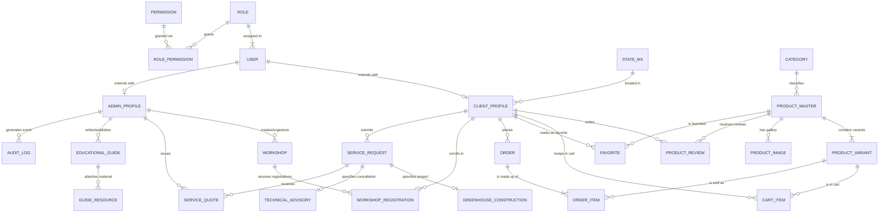
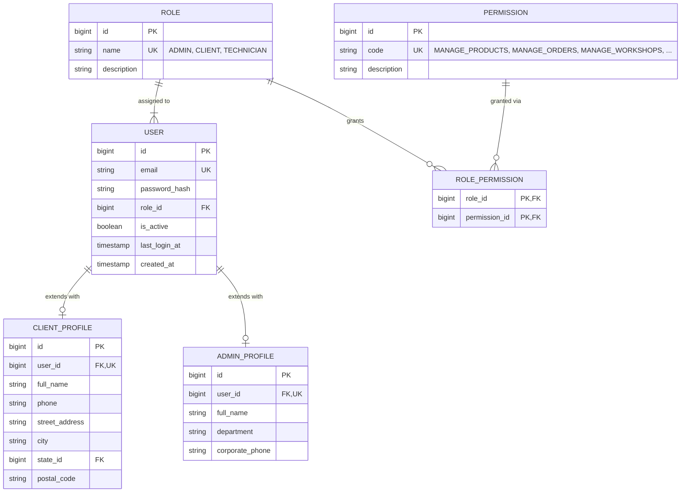
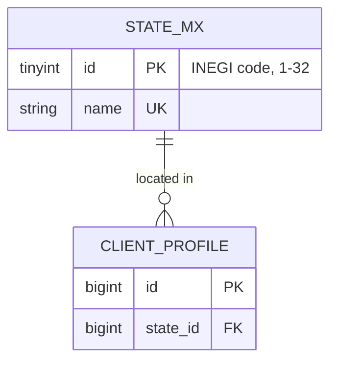
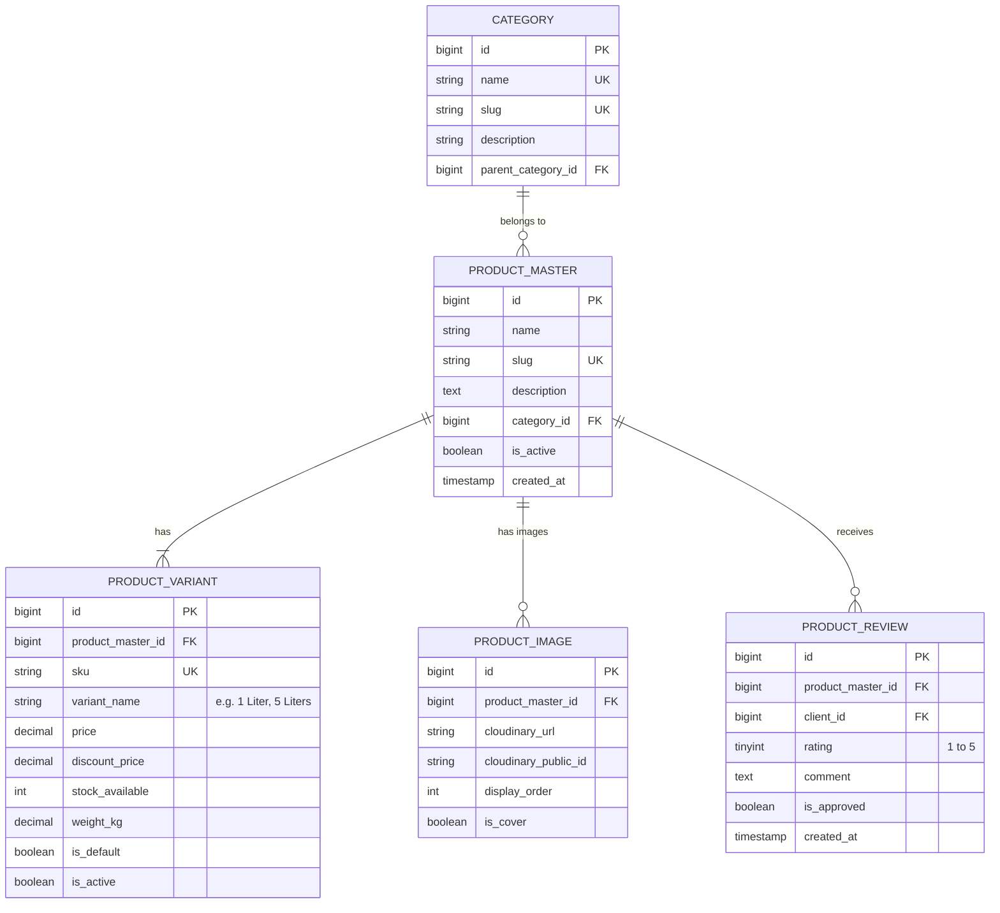
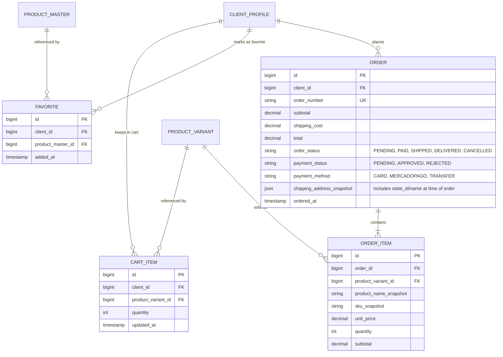
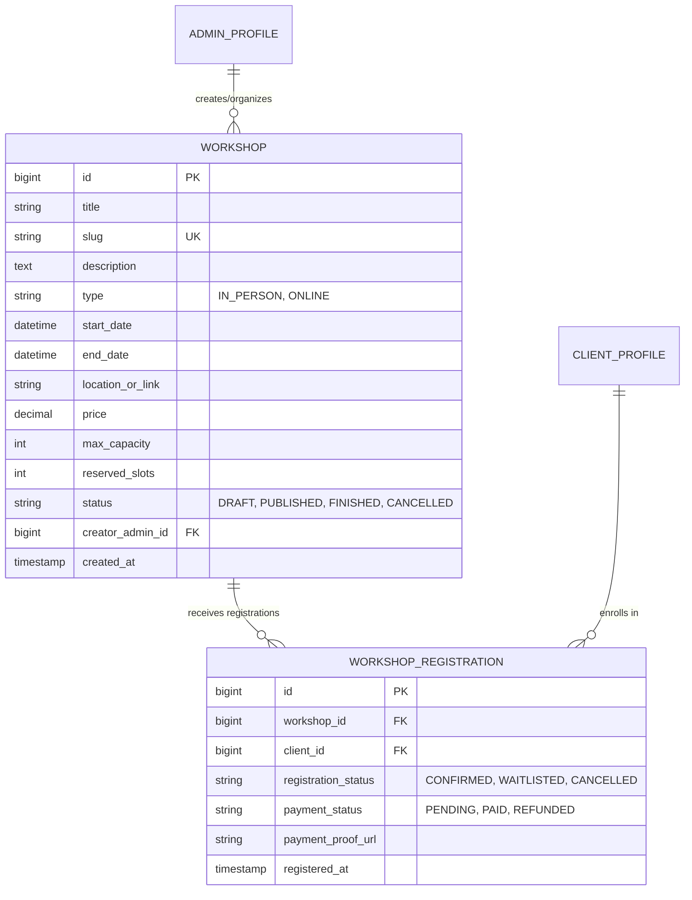
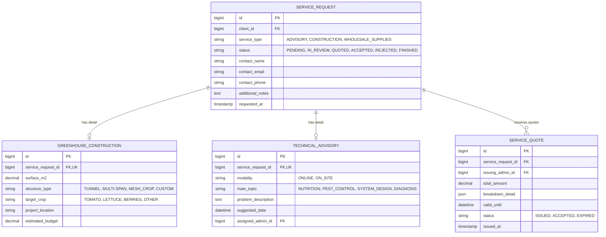
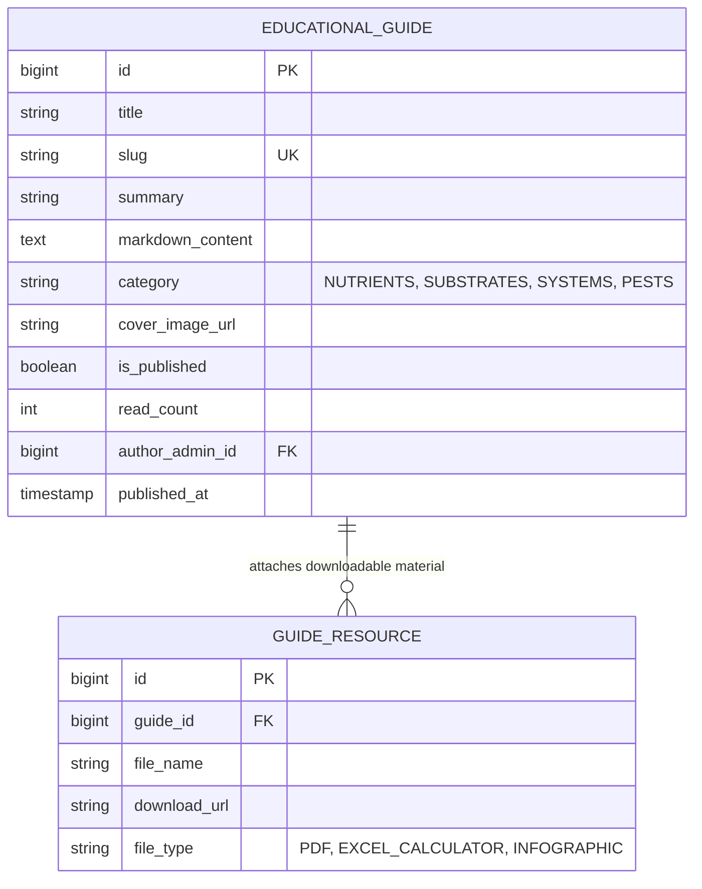
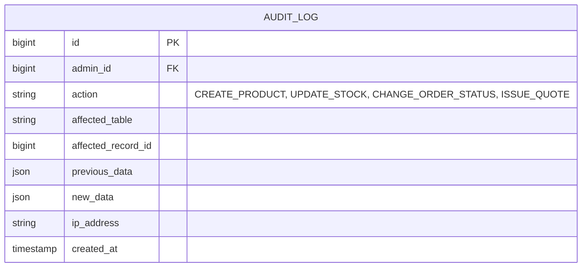

# Entity-Relationship (E-R) Model — Honatu Hidroponía

This document specifies the complete **Entity-Relationship (E-R) Model** for the relational database of **Honatu Hidroponía**. The design follows the platform's unified architecture, allowing both **Clients** (purchases, workshop registrations, service requests, guide browsing) and **Administrators** (catalog management, inventory, workshop moderation, quote tracking, and auditing) to interact securely through a single system.

> **Changelog vs. previous version:** added `PERMISSION` / `ROLE_PERMISSION` (referenced in the text but never modeled), added `PRODUCT_REVIEW` (referenced in the global diagram but never defined), added the `STATE_MX` catalog (Mexican states) to replace the free-text `state` field, and renamed every entity/attribute to English.

---

## 1. System Overview

The database is structured into **8 main modules**:

1. **Users, Roles & Authentication**: Unified identity management (`USER`, `CLIENT_PROFILE`, `ADMIN_PROFILE`, `ROLE`, `PERMISSION`, `ROLE_PERMISSION`).
2. **Address Catalog**: Normalized reference data for shipping and profiles (`STATE_MX`).
3. **Store Catalog (E-Commerce)**: Separation of master product and variants (`PRODUCT_MASTER`, `PRODUCT_VARIANT`, `CATEGORY`, `PRODUCT_IMAGE`, `PRODUCT_REVIEW`).
4. **Sales & Transactions**: Purchases, favorites and carts (`ORDER`, `ORDER_ITEM`, `CART_ITEM`, `FAVORITE`).
5. **Workshops & Training**: Educational offerings and registrations (`WORKSHOP`, `WORKSHOP_REGISTRATION`).
6. **Specialized Services**: Technical projects and consultations (`SERVICE_REQUEST`, `GREENHOUSE_CONSTRUCTION`, `TECHNICAL_ADVISORY`, `SERVICE_QUOTE`).
7. **Education & Guides**: Content portal (`EDUCATIONAL_GUIDE`, `GUIDE_RESOURCE`).
8. **Administration & Audit**: Traceability and control (`AUDIT_LOG`).

---

## 2. Global Entity-Relationship Diagram

---

## 3. E-R Diagrams by Module

### Module 1: Users, Roles, Permissions & Profiles

Allows administrators and clients to share the same credential engine while differentiating permissions and profile information. `PERMISSION` and `ROLE_PERMISSION` were added so access control is actually modeled instead of only relying on a fixed `role_id` per user.

---

### Module 2: Address Catalog (Mexican States)

New module. Normalizes `CLIENT_PROFILE.state`, which previously was a free-text field with no referential integrity. Also enables consistent shipping-cost rules and sales-by-region reporting.

---

### Module 3: Store Catalog (Master Product & Variant)

Supports products with multiple configurations (e.g. A+B Nutrient Solution in 1L, 5L, 20L presentations; coconut fiber in 10L or 50L bags). `PRODUCT_REVIEW` was added — it appeared in the global diagram before but was never actually defined.

---

### Module 4: Sales, Orders, Cart & Favorites

---

### Module 5: Workshops & Training

Allows administrators to publish workshops (in-person or online) and clients to register and manage their seats.

---

### Module 6: Specialized Services (Greenhouse Construction & Advisory)

---

### Module 7: Education & Guides

---

### Module 8: Admin Panel & Audit

---

## 4. Summary of Changes From the Original Diagram

| Change | Reason |
| :--- | :--- |
| Added `PERMISSION` and `ROLE_PERMISSION` | Referenced in the module description but never modeled — access control was only a single fixed `role_id`. |
| Added `PRODUCT_REVIEW` | Appeared in the original global diagram (linked to `PRODUCT_MASTER` and `CLIENT_PROFILE`) but was never defined as an entity. |
| Added `STATE_MX` catalog and `CLIENT_PROFILE.state_id` (FK) | Replaces the free-text `state` field, which allowed inconsistent values (e.g. "Qro", "Querétaro", "QUERETARO") and broke reporting/filtering by region. Also needed for shipping-cost rules by state in `ORDER`. |
| Renamed all entities/attributes to English | Per request. |
| Noted `ORDER.shipping_address_snapshot` should carry `state_id` | Keeps historical orders reportable by state even though the snapshot is denormalized on purpose (address may change after the order is placed). |